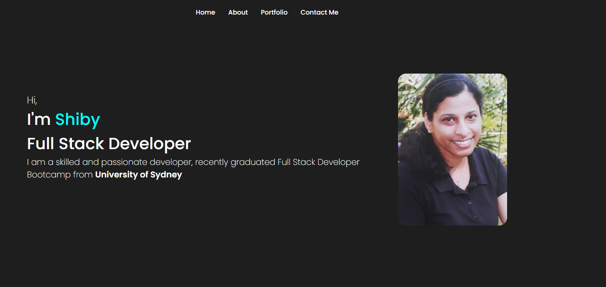
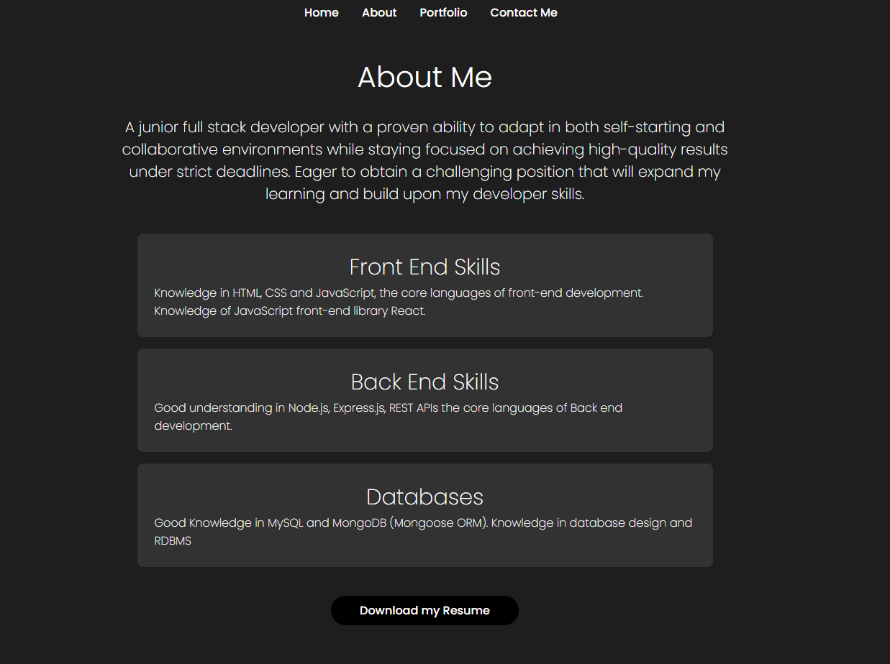

# Portfolio

## Description

My Portfolio Webpage is a showcase of my skills, projects, and achievements as a Full Stack Web Developer. An effective portfolio highlights latest technologies and thought processes behind it. Visitors can explore my projects, view my resume, and get in touch with me for potential collaborations or inquiries. This is a single page application

## ScreenShot

The following image shows the web application's appearance and functionality:

## Deployed Link

[The link for my deployed application can viewed here](https://shiby-mathew.github.io/portfolio-shiby/)

## GitHub Link

[The link for my GitHub](https://github.com/Shiby-Mathew/portfolio-shiby)

### Technologies Used

- HTML
- CSS
- React
